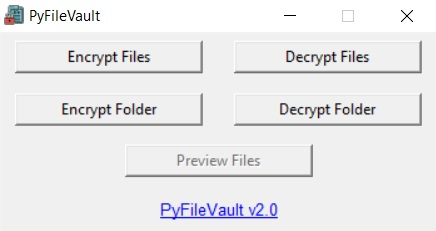

# PyFileVault

### A secure, cryptographic utility for encrypting your confidential data.
Encryption is completely offline and zero-knowledge. Encrypted files are portable. 
Original files will be deleted on encryption, be careful!

### **Make sure that you do not forgot the secret key used for encrypting files. There is no way to recover a file if the secret key is forgotten.**

Program can be run directly using the `exe` file or alternatively via the `py` file (`crypography` module needed). Or you can compile the code on your own system using `compile.bat`.

## To Do
- [ ] Filter by max size and extension.
- [ ] Add preview files feature.
- [ ] Add Linux and Mac support.
- [ ] Add progress bar.
- [ ] Show password button.
- [ ] Recovery key (hash of secret key) export.
- [ ] UI enhancements.

Feel free to fix bugs/add more features and send pull requests. :D

## Encryption Methodology

- User is asked to input a secret key (password) which is hashed using PBKDF2 with SHA-256. A salt is used.
- AES-256 GCM is used to encrypt the file(s) using the hashed password as key. A nonce is used to ensure file integrity.
